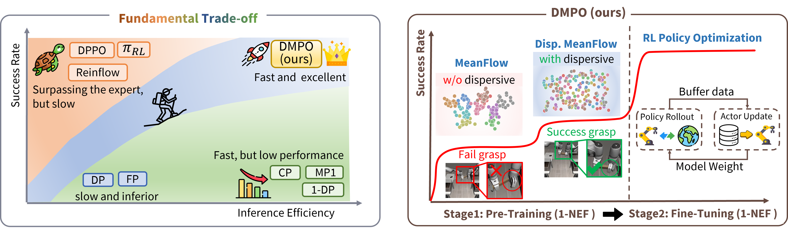
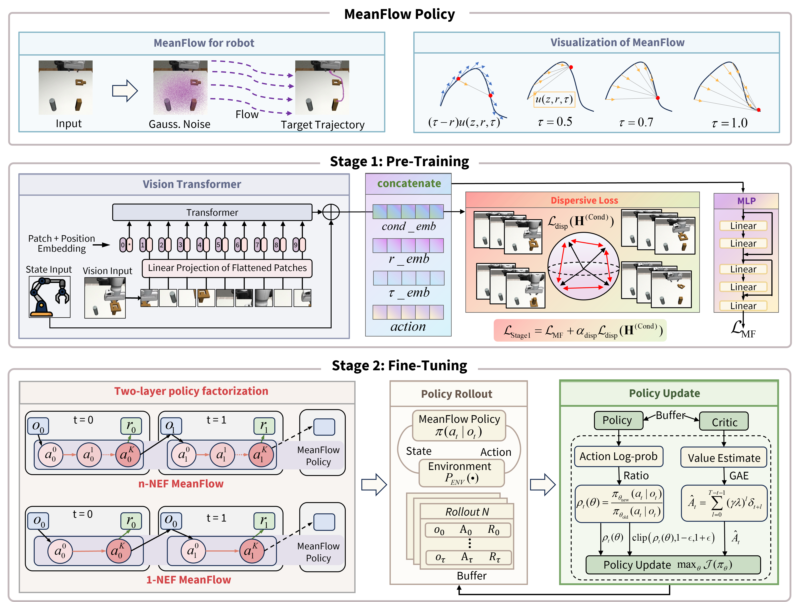
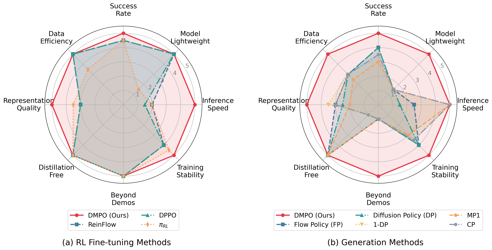

# DMPO: Dispersive MeanFlow Policy Optimization

<div align="center">

[](https://guowei-zou.github.io/dmpo-page/)
[](http://arxiv.org/abs/2601.20701)
[](https://www.youtube.com/watch?v=_vB_mchoux8)
[](https://www.bilibili.com/video/BV133zXBPEdb/?share_source=copy_web&vd_source=af323cc810d69452bd73799b93e838d6)

> **One Step Is Enough: Dispersive MeanFlow Policy Optimization**
> A unified framework enabling true one-step generation for real-time robotic control via MeanFlow, dispersive regularization, and RL fine-tuning.

[Guowei Zou](https://guowei-zou.github.io/Guowei-Zou/), Haitao Wang, [Hejun Wu](https://cse.sysu.edu.cn/teacher/WuHejun), Yukun Qian, [Yuhang Wang](https://hanlanqian.github.io/about/?lang=en), [Weibing Li](https://cse.sysu.edu.cn/teacher/LiWeibing)
<br>
Sun Yat-sen University

</div>

---

## Overview

<div align="center">


*From efficiency-performance trade-off to practical real-time control. Existing methods lie on the trade-off curve: multi-step approaches achieve strong performance but slow inference, while one-step methods are fast but unstable. DMPO breaks this trade-off by occupying the upper-right region.*
</div>

---

## Architecture at a Glance

<div align="center">


*DMPO workflow: Stage 1 (Top & Middle) – Pre-training with dispersive MeanFlow. Stage 2 (Bottom) – PPO fine-tuning formulated as a two-layer policy factorization.*
</div>

---

## Highlights

- **Single-Step Inference** – MeanFlow enables mathematically-derived one-step generation without knowledge distillation.
- **Dispersive Regularization** – Prevents representation collapse in one-step policies via information-theoretic foundations.
- **RL Fine-Tuning** – PPO-based optimization to surpass expert demonstrations with BC regularization.
- **Lightweight Architecture** – 1.78M parameters enabling >120Hz real-time control.
- **5-20× Speedup** – Significant inference acceleration over multi-step baselines.

---

## Quick Start

### 1. Clone & Environment Setup

```bash
git clone <DMPO_RELEASE_REPO_URL>
cd dmpo-release
conda create -n dmpo python=3.10 -y
conda activate dmpo
pip install -e .
```

Optional extras:
```bash
# Vision manipulation stack (Robomimic)
pip install -e .[robomimic]

# Full environment suite
pip install -e .[all]
```

### 2. External Dependencies

| Environment Suite | Requirement | Notes |
| ----------------- | ----------- | ----- |
| Robomimic | MuJoCo 2.1.0 | see `installation/install_mujoco.md` |
| OpenAI Gym | D4RL datasets | see `installation/install_d4rl.md` |
| Franka Kitchen | MuJoCo 2.1.0 | see `installation/install_kitchen.md` |

Set shared paths and logging endpoints:
```bash
source script/set_path.sh  # defines DATA_ROOT, LOG_ROOT, WANDB_ENTITY
```

---

## Datasets & Checkpoints

- **Demonstration datasets:** [Hugging Face](https://huggingface.co/datasets/Guowei-Zou/DMPO-datasets)
  Contains pre-processed demonstration data for gym and robomimic tasks.
- **Pretrained checkpoints:** [Hugging Face](https://huggingface.co/Guowei-Zou/DMPO-checkpoints)
  Contains DMPO pretraining and finetuned weights.

### Auto-download from Hugging Face

DMPO supports automatic download from Hugging Face. Use the `hf://` prefix in your config files:

**For datasets (pre-training):**
```yaml
# In your config file (e.g., cfg/gym/pretrain/hopper-medium-v2/pre_meanflow_dispersive_mlp.yaml)
train_dataset_path: hf://gym/hopper-medium-v2/train.npz
normalization_path: hf://gym/hopper-medium-v2/normalization.npz
```

**For checkpoints (fine-tuning):**
```yaml
# In your config file (e.g., cfg/gym/finetune/hopper-v2/ft_ppo_meanflow_mlp.yaml)
base_policy_path: hf://pretrained_checkpoints/DMPO_pretrained_gym_checkpoints/gym_improved_meanflow_dispersive/hopper-medium-v2_best.pt
```

Available datasets in the HF repository ([DMPO-datasets](https://huggingface.co/datasets/Guowei-Zou/DMPO-datasets)):
```
gym/
├── hopper-medium-v2/
├── walker2d-medium-v2/
├── ant-medium-expert-v2/
├── Humanoid-medium-v3/
├── kitchen-complete-v0/
├── kitchen-mixed-v0/
└── kitchen-partial-v0/

robomimic/
├── lift-img/
├── can-img/
├── square-img/
└── transport-img/
```

Available checkpoints in the HF repository ([DMPO-checkpoints](https://huggingface.co/Guowei-Zou/DMPO-checkpoints)):
```
pretrained_checkpoints/
├── DMPO_pretrained_gym_checkpoints/
│   ├── gym_improved_meanflow/          # MeanFlow without dispersive loss
│   └── gym_improved_meanflow_dispersive/  # MeanFlow with dispersive loss (recommended)
└── DMPO_pretraining_robomimic_checkpoints/
    ├── w_0p1/  # dispersive weight=0.1
    ├── w_0p5/  # dispersive weight=0.5 (recommended)
    └── w_0p9/  # dispersive weight=0.9

finetuned_checkpoints/
├── gym_meanflow/        # Fine-tuned gym checkpoints
└── robomimic_meanflow/  # Fine-tuned robomimic checkpoints
```

To use custom data, place trajectories under your data directory and update the corresponding YAML in `cfg/<ENV_GROUP>/pretrain/<TASK>.yaml`.

---

## Running DMPO

### Stage 1: Dispersive Pre-Training (Image-Based)

```bash
python script/run.py \
  --config-dir=cfg/robomimic/pretrain/<TASK_NAME> \
  --config-name=pre_meanflow_mlp_img_dispersive \
  denoising_steps=1 \
  dispersive.loss_type=infonce_l2 \
  dispersive.weight=0.5
```
Available `<TASK_NAME>`: `lift`, `can`, `square`, `transport`.

### Stage 1: State-Based Variants

```bash
python script/run.py \
  --config-dir=cfg/<ENV_GROUP>/pretrain/<TASK_NAME> \
  --config-name=pre_meanflow_mlp_state_dispersive
```
`<ENV_GROUP>` can be `gym`, `robomimic`, or `kitchen`.

### Stage 2: PPO Fine-Tuning

```bash
python script/run.py \
  --config-dir=cfg/robomimic/finetune/<TASK_NAME> \
  --config-name=ft_ppo_meanflow_mlp \
  base_policy_path=<PRETRAINED_CHECKPOINT_PATH>
```

### Evaluation & Rollouts

```bash
python script/run.py \
  --config-dir=cfg/robomimic/eval/<TASK_NAME> \
  --config-name=eval_meanflow_mlp \
  checkpoint_path=<CHECKPOINT_PATH>
```
Metrics and plots are stored in `dmpo_eval_results/`.

---

## Dispersive Loss Configuration

```yaml
model:
  use_dispersive_loss: true
  dispersive:
    weight: 0.5                    # regularization strength
    temperature: 0.3               # contrastive temperature
    loss_type: "infonce_l2"        # infonce_l2 | infonce_cosine | hinge | covariance
    target_layer: "mid"            # early | mid | late | all
```

> **Tip**: Start with `loss_type: infonce_l2`, `weight: 0.5`, `target_layer: mid` for Robomimic image tasks. Increase `weight` if training diverges or features collapse.

---

## Supported Tasks

| Domain | Tasks | Notes |
| ------ | ----- | ----- |
| Robomimic (RGB) | lift, can, square, transport | default configs under `cfg/robomimic` |
| OpenAI Gym | hopper, walker2d, ant, humanoid | state-based locomotion |
| Franka Kitchen | kitchen-partial, kitchen-complete, kitchen-mixed | state-based high-DOF control |

Real robot deployment scripts (Franka-Emika-Panda) are provided under `script/real_robot/`.

---

## Reference Metrics

### Comparison with One-Step Baselines (Robomimic)

| Method | NFE | Distill. | Lift | Can | Square | Transport |
| ------ | --- | -------- | ---- | --- | ------ | --------- |
| DP-C (Teacher) | 100 | - | 97% | 96% | 82% | 46% |
| CP | 1 | Yes | - | - | 65% | 38% |
| OneDP-S | 1 | Yes | - | - | 77% | 72% |
| MP1 | 1 | No | 95% | 80% | 35% | 38% |
| **DMPO (Ours)** | **1** | **No** | **100%** | **100%** | **83%** | **88%** |

### Model Efficiency Comparison

| Model | Vision | Params | Steps | Time (4090) | Freq | Speedup |
| ----- | ------ | ------ | ----- | ----------- | ---- | ------- |
| DP (DDPM) | ResNet-18x2 | 281M | 100 | 391.1ms | 2.6Hz | 1x |
| CP | ResNet-18x2 | 285M | 1 | 5.4ms | 187Hz | 73x |
| MP1 | PointNet | 256M | 1 | 4.1ms | 244Hz | 96x |
| **DMPO (Ours)** | **light ViT** | **1.78M** | **1** | **0.6ms** | **1770Hz** | **694x** |

### Holistic Radar Comparison

<div align="center">


*Holistic radar comparison across eight dimensions. (a) RL fine-tuning methods: DMPO forms the outer envelope, achieving top scores across all dimensions. (b) Generation methods: DMPO outperforms all baselines by combining one-step inference with lightweight architecture, high data efficiency, and the ability to go beyond demonstrations.*
</div>

---

## Repository Map

```
dmpo-release/
├── agent/                    # training & evaluation agents
│   ├── pretrain/            # pre-training scripts
│   └── finetune/            # PPO fine-tuning scripts
├── cfg/                      # experiment YAMLs (Hydra configs)
│   ├── robomimic/           # Robomimic tasks
│   ├── gym/                 # OpenAI Gym tasks
│   └── kitchen/             # Franka Kitchen tasks
├── model/                    # model architectures
│   ├── flow/                # MeanFlow implementation
│   ├── diffusion/           # diffusion baselines
│   └── common/              # shared components (ViT, MLP)
├── env/                      # environment wrappers
├── util/                     # utilities
├── script/                   # launch scripts
│   ├── run.py               # unified launcher
│   └── real_robot/          # real robot deployment
├── installation/             # environment setup guides
├── docs/                     # extended documentation
└── sample_figs/              # sample figures
```

---

## Our Contributions

1. **Framework:** We introduce DMPO, a unified framework enabling stable one-step generation via principled co-design of architecture and algorithms, with 5-20× speedup over multi-step baselines.

2. **Theory:** We establish the first information-theoretic foundation proving dispersive regularization is necessary for stable one-step generation, and derive the first mathematical formulation for RL fine-tuning of one-step policies.

3. **Validation:** We achieve state-of-the-art on RoboMimic and OpenAI Gym benchmarks, and validate real-time control (>120Hz) on a Franka robot.

---

## Citation

If you find this work useful, please cite:

```bibtex
@misc{zou2026stepenoughdispersivemeanflow,
      title={One Step Is Enough: Dispersive MeanFlow Policy Optimization}, 
      author={Guowei Zou and Haitao Wang and Hejun Wu and Yukun Qian and Yuhang Wang and Weibing Li},
      year={2026},
      eprint={2601.20701},
      archivePrefix={arXiv},
      primaryClass={cs.RO},
      url={https://arxiv.org/abs/2601.20701}, 
}
```

---

## Acknowledgments

DMPO builds upon several excellent open-source projects:
- [Diffusion Policy](https://github.com/real-stanford/diffusion_policy)
- [ReinFlow](https://github.com/ReinFlow/ReinFlow)
- [DPPO](https://github.com/irom-princeton/dppo)
- [Robomimic](https://github.com/ARISE-Initiative/robomimic)
- [MeanFlow / Shortcut Models](https://github.com/kvfrans/shortcut-models)

See `THIRD_PARTY_LICENSES.md` for complete dependency attributions.

---

## License

Released under the MIT License. See [LICENSE](LICENSE) for details.

---

## Contact

- Submit issues: [GitHub Issues](<DMPO_ISSUES_URL>)
- Email: zougw3@mail2.sysu.edu.cn (Guowei Zou)
